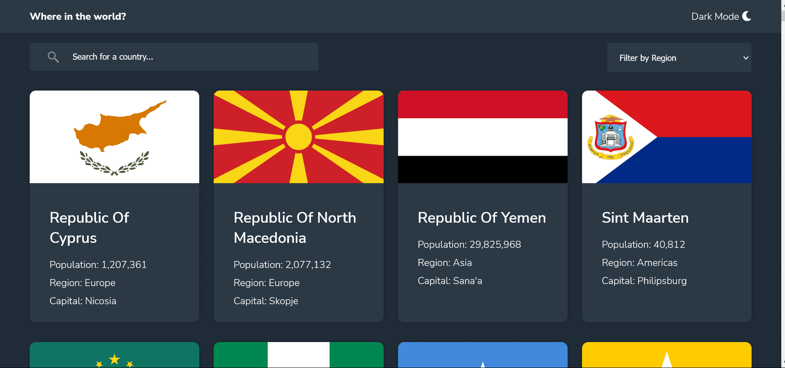

# Frontend Mentor - REST Countries API with color theme switcher solution

This is a solution to the [REST Countries API with color theme switcher challenge on Frontend Mentor](https://www.frontendmentor.io/challenges/rest-countries-api-with-color-theme-switcher-5cacc469fec04111f7b848ca). Frontend Mentor challenges help you improve your coding skills by building realistic projects.

## Table of contents

- [Overview](#overview)
  - [The challenge](#the-challenge)
  - [Screenshot](#screenshot)
  - [Links](#links)
- [My process](#my-process)
  - [Built with](#built-with)
  - [What I learned](#what-i-learned)
  - [Continued development](#continued-development)
  - [Useful resources](#useful-resources)
- [Author](#author)
- [Acknowledgments](#acknowledgments)

## Overview

### The challenge

Users should be able to:

- See all countries from the API on the homepage
- Search for a country using an `input` field
- Filter countries by region
- Click on a country to see more detailed information on a separate page
- Click through to the border countries on the detail page
- Toggle the color scheme between light and dark mode _(optional)_

### Screenshot



### Links

- Solution URL: (https://github.com/JulianIfesiokwu/rest-countries-api-with-color-theme-switcher)
- Live Site URL: (https://julianifesiokwu.github.io/rest-countries-api-with-color-theme-switcher/)

## My process

This project is quite challenging, I started by building the HTML based on desktop view. After completeing this, I moved on to styling the project. I worked firstly on the mobile view before moving to desktop view. The mobile view starts from 375px to 740px, desktop view starts from 741px. I decided not to make for other viewpoints because the project specifications were for these 2 views in particular. After completion of this I started work on interactivivty using JavaScript. However as I progressed I had to change my HTML.

### Built with

- Semantic HTML5 markup
- CSS custom properties
- Flexbox
- JavaScript
- Mobile-first workflow

### What I learned

The project is quite complicated and has a lot of moving parts. I learnt how to create
-toggle between dark and light mode.
-make and handle multiple API requests.
-check the data and datatype returned from requests.
-how to use the forEach method for arrays.
-how to convert the nodelist returned from a querySelectorAll query to an array.
-how to use try and catch blocks for API requests.
-how to use async and await in try catch blocks as this a better alternative to usuing fetch.
-how to use guard clauses which is much better than nested if statements.
-how to search for and implement other persons code in my own code.
-how to use while loops to remove child elements.

I am particularly proud of my JavaScript. The project has a lot of JavaScript and requires a good undertsanding of APIs, arrays, objects, how to traverse the DOM, manipulate different data types, use of different query selectors, try catch blocks, async and await for fetching from APIs.

```js
const showDetailedInfo = async (targetCountry) => {
  try {
    const url = `https://restcountries.eu/rest/v2/name/${targetCountry}`;
    const result = await fetch(url);
    const countryData = await result.json();
    // display results based on targetCountry
    showDetailedCountry(countryData);
  } catch (err) {
    console.log(err);
  }
};

// change background of back btn
backBtn.style.background = "var(--Dark-Blue)";
backArrow.setAttribute("src", "./images/icon-left-arrow white.svg");
// change background of search container
document.querySelector(".search__container").style.background =
  "var(--Dark-Blue)";
// change background of border countries
const borderCountries = [...document.querySelectorAll(".border--countries")];
borderCountries.forEach((borderCountry) => {
  borderCountry.style.background = "var(--Dark-Blue)";
});
```

### Continued development

I hope to continue my understanding of APIs, handling arrays, async await, loops and using the try catch block.

### Useful resources

I used a ton of resources for this project and I cant name them all due to space constraints but of great importance are:

https://www.w3schools.com
https://developer.mozilla.org/en-US/docs/Web/API/Element/closest
https://www.w3schools.com/jsref/prop_element_children.asp
https://javascript.info/event-delegation
https://www.w3schools.com/howto/howto_css_placeholder.asp
https://www.microverse.org/blog/how-to-loop-through-the-array-of-json-objects-in-javascript
https://www.javascripttutorial.net/dom/css/replace-a-class-of-an-element/
https://www.jstips.co/en/javascript/converting-a-node-list-to-an-array/

## Author

- Frontend Mentor - [@yourusername](https://www.frontendmentor.io/profile/egbuna09)
